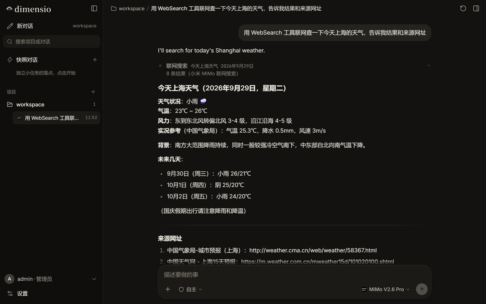

# WorkBuddy Bridge

[English](README.md) · **简体中文**

**一个能用浏览器打开的 Claude Code / AI agent 工作台。** 装好之后，用手机或电脑的浏览器打开一个网址，就能用 Claude Code 写代码、处理文件、跑命令。也可以选装 **dimensio**，一个能接各家模型 API 的 agent 工作台，支持 Anthropic、OpenAI、Gemini、DeepSeek、Kimi、智谱、通义、小米 MiMo 等。

服务端只听 127.0.0.1，对外经 Cloudflare 隧道或你自己的反向代理暴露。两种装法：**普通 Linux 服务器**（推荐，自己敲几条命令）或**托管平台的一键部署**（把一段话发给平台上的 agent，它替你装好）。



## 亮点

- **手机、电脑都能用**：打开网址就是完整的工作台，界面支持简体中文和 English，默认跟着浏览器语言。
- **安卓 app**：在「设置 → 安卓 app」里下载，或者[直接下载 apk](https://github.com/shimoyanyamua/workbuddy-bridge/releases/latest/download/WorkBuddyBridge.apk)。记得住服务器地址，临时地址变了能在 app 里直接换；界面和网页版一样，随服务器自动更新。
- **Claude Code 完整体验**：由官方 Claude Agent SDK 驱动，支持工具调用、子 agent、工作流、上下文压缩和会话续接。右侧工作台有终端、文件、任务和改动审阅。
- **dimensio 多模型工作台**：一家一把 key，随时切换模型；也能接任意 OpenAI 兼容的自定义服务。自带工作区、记忆和子 agent。
- **各家原生联网搜索**：当前对话用哪家模型，就先用哪家自己的搜索，失败了自动换下一家，最后才退回 DuckDuckGo。
- **重启自动恢复**：托管部署下，平台重启 VM 后看门狗在 60 秒内把服务拉起来；临时地址变了，会主动告诉你新地址。
- **主动提醒更新**：有新版本时会用一两句话告诉你更新了什么，问你要不要更新。更新会等没人在聊天时才切换，新版本起不来会自动退回。
- **可以多人用**：用邀请码注册，每个账号有独立的目录，可以按人分配 agent 和额度。

## 在普通 Linux 服务器上装

Debian / Ubuntu，**有 systemd**：

```bash
git clone https://github.com/shimoyanyamua/workbuddy-bridge.git /opt/workbuddy-bridge && cd /opt/workbuddy-bridge
sudo bash scripts/server/install.sh --agents claude,dimensio
```

`install.sh --help` 查看全部选项。服务只听本机 127.0.0.1，对外访问需要你自己配隧道或反向代理（加 `--tunnel-token` 可以顺带起一条 Cloudflare 命名隧道）。更新用 `sudo bash scripts/server/update.sh`。

装完浏览器打开服务地址，用安装时打印的管理员令牌登录。接着去「设置 → 连接 → 服务端控制台 → Claude 账号」把 Claude 订阅令牌填进去（见下节）。

**我该走哪条安装路径？** 这个项目自带两套安装器，不能混用：

| 你的机器 | 用哪个 |
|---|---|
| 特定托管平台的 agent VM（`/etc/hosts` 里有 `hatch-egress-proxy` 的那个平台；平台自带 hook/自动化系统） | `deploy/workbuddy/` —— 把下面的一键部署提示词发给平台 agent，由它跑 `bootstrap.sh` |
| 其他 Debian/Ubuntu Linux，**有 systemd**（VPS、裸金属、自己的容器宿主） | `scripts/server/install.sh`（上面的命令） |
| Debian/Ubuntu，**没有 systemd**（纯容器、chroot） | `scripts/server/run-standalone.sh` —— 见[无 systemd 环境运行](#无-systemd-环境运行) |

把 `bootstrap.sh` 用到它的平台之外，它会立刻退出并告诉你原因——这是有意为之，换用 `install.sh` 就好。这条边界在 `WORKBUDDY.md` 开头也有声明。

**核对下载的包。** `install.sh` 从 git 克隆构建，所以这一步只在你用发布包安装时适用：用 `workbuddy-bridge.tgz.sha256` 核对 `workbuddy-bridge.tgz`。如果这个小文件下载不动（有些网络过不了 release 资产的重定向），可以问 GitHub API 要它上传时记录的 digest，手动比对：

```bash
curl -fsSL https://api.github.com/repos/shimoyanyamua/workbuddy-bridge/releases/latest | jq -r '.assets[] | select(.name=="workbuddy-bridge.tgz") | .digest'   # → sha256:…
sha256sum workbuddy-bridge.tgz
```

## 无 systemd 环境运行

容器和 chroot 环境常常没有 systemd。服务本身并不需要它：`scripts/server/run-standalone.sh` 会前台拉起服务，环境变量和 systemd 单元设置的完全一样（数据目录、dimensio 路径、端口/监听地址），不会有东西悄悄缺失：

```bash
sudo bash scripts/server/run-standalone.sh                       # 默认：/var/lib/bridge，127.0.0.1:8787
sudo bash scripts/server/run-standalone.sh --data /srv/bridge --port 8787 --host 127.0.0.1
```

想让进程崩了自动拉起（等价于单元里的 `Restart=always`），套一个 keepalive 循环——服务挂掉后几秒内就会回来：

```bash
while true; do sudo bash scripts/server/run-standalone.sh; sleep 3; done
```

把循环放到 `nohup`/`setsid` 或你自己的守护工具下面跑；再放一个 `/etc/bridge/bridge.env` 文件写 `CLAUDE_CODE_OAUTH_TOKEN` 和代理变量（格式和 systemd 方案读的相同）；隧道或反向代理照常指到这个端口。如果看到 Node 版本告警，显式传对二进制：`--node /usr/bin/node`——不管有没有告警都建议用绝对路径钉死，免得 shell 的 PATH 变了之后服务退回旧版 Node。

## 在托管平台的 VM 上一键部署

如果你的服务器是某个托管平台（agent VM）给的，可以把整段话发给平台上的 agent，让它替你装：

````text
我想请你在这台 VM 上安装 WorkBuddy Bridge，装好后教我怎么用。这是我自己选的一个开源项目（MIT 协议）：一个能用浏览器打开的 Claude Code / AI agent 工作台。源码和发布包在 https://github.com/shimoyanyamua/workbuddy-bridge （项目比较新，搜索引擎可能还搜不到，直接打开这个链接就行）。

第一步，下载最新的发布包并核对校验和：

```bash
REL=/home/hatch/bridge-releases/$(date +%Y%m%d-%H%M%S) && mkdir -p "$REL" && chmod 755 /home/hatch/bridge-releases "$REL"
cd /tmp && curl -fLO --retry 3 https://github.com/shimoyanyamua/workbuddy-bridge/releases/latest/download/workbuddy-bridge.tgz && curl -fLO --retry 3 https://github.com/shimoyanyamua/workbuddy-bridge/releases/latest/download/workbuddy-bridge.tgz.sha256 \
  && sha256sum -c workbuddy-bridge.tgz.sha256 && tar -xzf workbuddy-bridge.tgz -C "$REL" && echo "解压到 $REL/bridge"
```

第二步，读 `$REL/bridge/deploy/workbuddy/WORKBUDDY.md`，这是项目专门写给你的安装指南。按它来：先按第 1 节用一条消息问我三个安装问题，然后安装、配好看门狗 hook、检查结果，再带我上手。里面如果有你觉得不对或不安全的地方，停下来问我。

每条命令都要我批准，所以请尽量少跑命令。安装脚本会自己打印进度，不用拿 tail、ps、sleep 去轮询。每一步都把真实输出给我看。
````

> 如果这台 VM 出站要走 HTTP CONNECT 代理（比如 `/etc/hosts` 里有 `hatch-egress-proxy`），`bootstrap.sh` 会自己处理，不用你在提示词里写代理变量。普通 Linux 服务器请直接用上面那条 `install.sh`。

平台会下载安装包、读安装指南，然后一次问你三个问题：

1. **装什么**：只要 Claude Code、只要 dimensio，还是两个都要。只选一个时，打开网址直接就是那个 agent。
2. **有没有自己的域名**（托管在 Cloudflare）：没有就用免费的临时地址，VM 重启后地址会变，变了平台会告诉你；有的话可以换成固定地址。
3. **自己用还是多人用**：选多人用，就可以给朋友发邀请码。

拿不准就选：只要 Claude Code、临时地址、自己用。这些以后都能改。

## 你需要准备

- 一台 Debian / Ubuntu 的机器——有 systemd、没有 systemd（见上文），或者一个托管平台的 agent VM。
- 用 Claude Code：一个 Claude Pro 或 Max 订阅。令牌要在**你自己的电脑上**运行 `claude setup-token` 生成，不要在服务器上登录 Claude。
- 用 dimensio：至少一家模型厂商的 API key。

## dimensio 支持哪些模型


| 厂商 | key 的名字 | 联网搜索 |
|---|---|---|
| Anthropic（Claude） | `ANTHROPIC_API_KEY` | ✓ 自家搜索 |
| DeepSeek | `DEEPSEEK_API_KEY` | ✓ 自家搜索 |
| Google Gemini | `GEMINI_API_KEY` | ✓ Google 搜索 |
| Kimi（Kimi for Coding 订阅，`sk-kimi-` 开头） | `KIMI_API_KEY` | ✓ 自家搜索 |
| 智谱 GLM | `ZHIPU_API_KEY` | ✓ 自家搜索 |
| 通义千问 | `QWEN_API_KEY` | ✓ 自家搜索 |
| 小米 MiMo（按量付费或 Token Plan） | `MIMO_API_KEY` | 见下 |
| 任意 OpenAI 兼容服务 | 在界面里点「＋」添加 | — |

key 可以直接在 dimensio 的模型面板里填；用 `bootstrap.sh` 装的，也可以让平台 agent 帮你写进去（`set-api-key`）。

**小米的联网搜索**是控制台「插件管理」里的一个插件，按次计费（约 ¥16 / 千次），钱从账户余额里扣，所以只有**按量付费**的 key 能用。如果你聊天用的是 Token Plan 订阅的 key（`tp-` 开头），可以再建一把按量付费的 key，单独配给搜索：`set-api-key MIMO_SEARCH_API_KEY <sk-…>`，聊天照旧用 Token Plan 的额度。不配也行，小米搜不了会自动换别家。

## 安卓 app

用手机浏览器打开你的 WorkBuddy Bridge 地址并登录，进「**设置 → 安卓 app → 下载**」。装好后回到这一页点「**在 app 里打开**」，app 会自动填好地址。也可以从 GitHub [直接下载 apk](https://github.com/shimoyanyamua/workbuddy-bridge/releases/latest/download/WorkBuddyBridge.apk)，第一次打开时把地址粘进去。

app 只是把同一个网页界面装进独立窗口，新功能不用更新 app。连不上服务器时（比如重启后临时地址变了），app 会给出「更换地址」按钮，拿到现在的地址粘进去就行。手机拦着不让装时，按提示允许浏览器安装应用。iPhone 目前没有 app，可以用 Safari 的「分享 → 添加到主屏幕」。

## 常见问题

**地址隔几个小时就变了？**
临时地址（`*.trycloudflare.com`）会随 VM 重启而变。托管部署下，变了平台会主动告诉你新地址，登录令牌不变，换了地址重新登录一次就行。嫌麻烦就换成自己的域名（`set-domain`），或者在普通服务器上配一条自己的隧道。

**平台老让我批「允许 … 与某网站分享信息？」，是怎么回事？**
托管平台的 VM 每访问一个新网站，都要你在平台里批一次。安装和填 key 时，WorkBuddy Bridge 会趁你在场，把要用到的网站提前访问一遍，把审核卡片都弹出来。遇到这种卡片（可能在输入框上方，也可能在右侧的「待审核」面板里），选「允许一次」旁边下拉里的「**总是允许此站点**」，以后就不会再问。如果某个对话一直停在「等待模型回复」，多半是有一张卡片没人批。

**怎么更新？**
托管部署：什么都不用做，有新版本时平台会来问你，你说「更新」就行。普通服务器：`sudo bash scripts/server/update.sh`。

**花钱吗？**
WorkBuddy Bridge 本身免费开源。Claude Code 用的是你自己的 Claude 订阅；dimensio 用的是你自己的模型 API key，费用由各家厂商按量收取。

## 限制

- 托管平台的 VM 起不了浏览器沙箱，所以 agent 没有「打开网页、截图」这类浏览器工具；联网搜索和抓网页内容照常可用。自己拿普通服务器装则不受此限。
- 托管平台的 VM 不是正式服务器：平台随时可能调整网络，长期对外提供服务也可能违反平台条款。别放重要数据，也别当生产环境用。

## 目录

| 路径 | 内容 |
|---|---|
| `src/` | 服务端（Node 24，零构建） |
| `web/` | 前端（Vite + Svelte 5） |
| `harness/` | dimensio（TypeScript，Node 原生运行） |
| `android/` | 安卓 app（WebView 壳，零依赖；发版流程负责构建） |
| `scripts/server/` | 通用 Linux 安装 / 更新脚本 |
| `deploy/workbuddy/` | 托管平台专用：一键部署脚本 `bootstrap.sh`、给部署 agent 看的说明书 `WORKBUDDY.md`、运维件模板 |

## 发布新版本（维护者）

推一个 `v*` 标签。建议用带说明的标签，说明会作为更新内容展示给用户：

```bash
git tag -a v0.2.0 -m "这次更新了什么（给用户看的一两句）"
git push origin v0.2.0
```

GitHub Actions（`.github/workflows/release.yml`）会构建安卓 app（`WorkBuddyBridge.apk`，挂在 Release 上，也放进安装包的 `downloads/`），打包 `workbuddy-bridge.tgz`，生成 `.sha256` 和更新频道 `latest.json`，并创建 Release。已经装好的服务器每 6 小时读一次 `latest.json`，发现新版本就问用户要不要更新。beta（如 `v0.2.0-beta.1`）也会推送。只有标签里带 `-test` 的（如 `v0.2.0-test.1`）会发成预发布版，不进更新频道，是给维护者在新服务器上试装用的。

apk 用仓库 Actions secrets 里的密钥签名（`ANDROID_KEYSTORE_BASE64`、`ANDROID_KEYSTORE_PASSWORD`、`ANDROID_KEY_ALIAS`、`ANDROID_KEY_PASSWORD`）。没配（比如 fork）就退回 debug 签名：照样能装，但不能覆盖安装官方发布的包。

## 协议

[MIT](LICENSE)——另见 [NOTICE](NOTICE)：本项目基于 [muse-bridge](https://github.com/Wode44398/muse-bridge)（MIT）改造而来。Claude Code 与 Claude Agent SDK 的使用受 Anthropic 自己的条款约束；部署到托管平台时，请同时遵守该平台的条款。
